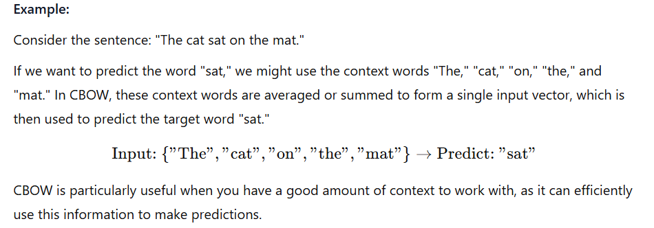
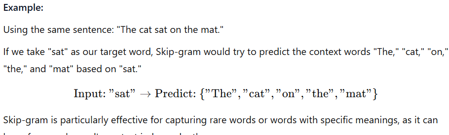
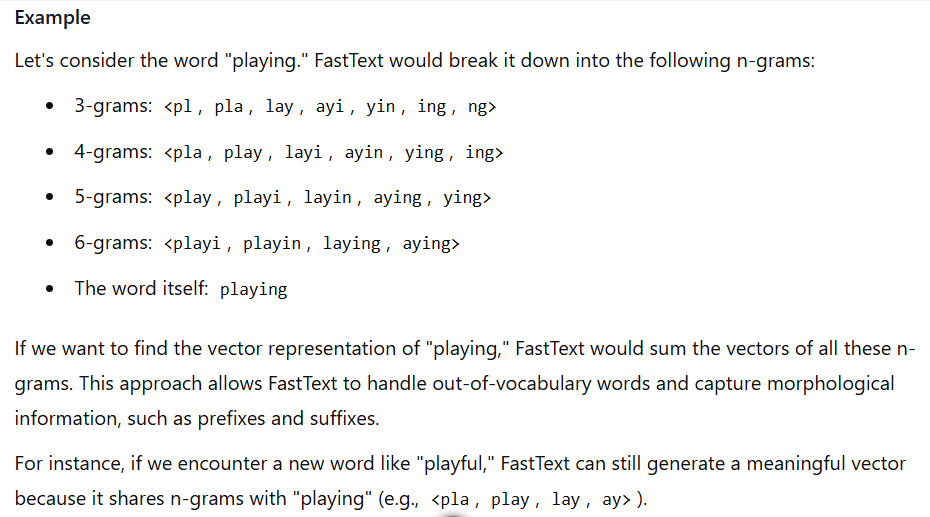

# Embeddings

Embeddings are a fundamental concept in machine learning and natural language processing (NLP). They are numerical representations of data, such as words, sentences, or even entire documents, that capture their meaning, relationships, and context in a way that machines can process. Embeddings transform high-dimensional, sparse data (like text) into lower-dimensional, dense vectors, making it easier for models to understand and work with the data.

## Key Characteristics of Embeddings:

- **Dimensionality Reduction**: Embeddings reduce the complexity of data by representing it in a lower-dimensional space. For example, a word might be represented as a vector of 50, 100, or 300 dimensions instead of a one-hot encoded vector with thousands of dimensions.

- **Semantic Meaning**: Embeddings capture semantic relationships between words or entities. For instance, words with similar meanings (e.g., "king" and "queen") will have similar vector representations.

- **Context Awareness**: Modern embeddings, such as those from models like BERT or GPT, are context-aware, meaning they can represent the same word differently depending on its context in a sentence.

- **Generalization**: Embeddings allow models to generalize better by learning patterns and relationships from large datasets, which can then be applied to new, unseen data.

## Types of Embeddings

There are several types of embeddings used in Natural Language Processing (NLP):

1. **Word Embeddings**: These represent individual words as dense vectors in a continuous vector space.
   - Word2Vec: Uses neural networks to learn word representations, with two main variants: Skip-gram and Continuous Bag of Words (CBOW).
   - GloVe (Global Vectors): Leverages global word-word co-occurrence statistics to create embeddings.
   - FastText: It extends the concept of word embeddings to subword information, allowing it to generate vectors for out-of-vocabulary words by breaking them down into character n-grams.

2. **Sentence Embeddings**: Represent entire sentences as vectors, capturing their overall meaning.
   - Simple averaging of word vectors
   - More advanced models that consider word order and sentence structure

3. **Character Embeddings**: Represent individual characters as vectors, useful for handling out-of-vocabulary words and morphologically rich languages.

4. **Byte Pair Encoding (BPE)**: A hybrid approach between character and word-level embeddings, which breaks words into subword units.

5. **Contextualized Embeddings**: Generate dynamic representations based on the context in which words appear.
   - BERT (Bidirectional Encoder Representations from Transformers): Produces high-quality context-aware embeddings using attention mechanisms.

6. **Document Embeddings**: Represent entire documents as vectors, capturing their overall content and meaning.

# Word Embedding 

Word embedding is a technique in natural language processing (NLP) where words or phrases from a vocabulary are mapped to vectors of real numbers. This mapping allows words with similar meanings to have similar representations in a high-dimensional space, capturing semantic relationships between words.

- some popular methods are:
    1. **Word2Vec**: Developed by Google, Word2Vec can create word embeddings using two architectures: ***Continuous Bag of Words (CBOW) and Skip-gram***. CBOW predicts a target word based on its context, while Skip-gram predicts context words given a target word.
        - ***Continuous Bag of Words (CBOW)***: CBOW predicts a target word based on its context. It takes the surrounding words (context) as input and tries to predict the target word in the middle. The idea is that the context words can help infer the meaning of the target word.
        \
        [This is the reference](https://www.kdnuggets.com/2018/04/implementing-deep-learning-methods-feature-engineering-text-data-cbow.html).

        - ***Skip-gram***: Skip-gram does the opposite of CBOW. It takes a target word as input and tries to predict the surrounding context words. This method is based on the idea that a word can be understood by the company it keeps.
        \
        [This is the reference](https://medium.com/@RobuRishabh/learning-word-embeddings-with-cbow-and-skip-gram-b834bde18de4).
    
    2. **GloVe (Global Vectors for Word Representation)**

    3. **FastText**: FastText is a library for efficient learning of word representations and sentence classification developed by Facebook AI Research. It extends the concept of word embeddings to subword information, allowing it to generate vectors for ***out-of-vocabulary*** words by breaking them down into character n-grams.

        **FastText Working**
        

        **FastText Example**
        \
        [This is the reference](https://www.analyticsvidhya.com/blog/2023/01/introduction-to-fasttext-embeddings-and-its-implication/).

        - Benefits of FastText
            - **Handling Out-of-Vocabulary Words**: By using subword information, FastText can generate vectors for words it has never seen before.
            - **Capturing Morphological Information**: It can capture the meaning of words based on their parts, which is particularly useful for languages with rich morphology.
            -  **Efficiency**: FastText is designed to be fast and scalable, making it suitable for large datasets.

# Sentence Embedding
Sentence embedding is a technique in natural language processing (NLP) where entire sentences are mapped to vectors of real numbers. This mapping allows sentences with similar meanings or contexts to have similar representations in a high-dimensional space, capturing semantic relationships between sentences.

### **How Sentence Embedding Works**

## 1.  **Averaging Word Embeddings**:

(This is only one case) Similar to word embeddings, sentence embeddings aim to represent the meaning of a sentence in a way that can be processed by machine learning algorithms. The process typically involves:

- **Tokenization**: Breaking down the sentence into individual words or tokens.
- **Word Embedding**: Converting each token into a vector using techniques like Word2Vec, GloVe, or FastText.
- **Aggregation**: Combining these word vectors into a single vector that represents the entire sentence. This can be done through methods like averaging, using recurrent neural networks (RNNs), or more advanced models like transformers.

#### **Applications of Sentence Embedding**
- Sentence embeddings are used in various NLP tasks, including:
    - **Semantic Search**: Finding sentences or documents that are semantically similar to a given query.
    - **Text Classification**: Categorizing sentences into predefined classes based on their content.
    - **Sentiment Analysis**: Determining the sentiment or emotional tone of a sentence.
    - **Machine Translation**: Translating sentences from one language to another while preserving meaning.

#### Example
Consider the sentences:\
"The cat is sleeping on the couch."\
"The dog is resting on the sofa."\
Both sentences convey similar meanings about an animal resting on a piece of furniture. A good sentence embedding model would map these sentences to vectors that are close to each other in the vector space, reflecting their semantic similarity.

## 2.  **Transformer based Word Embeddings**:

Transformer models, like ***BERT (Bidirectional Encoder Representations from Transformers), RoBERTa***, and others, use ***self-attention mechanisms*** to weigh the importance of different words in a sentence relative to each other. This allows them to understand the context of words within a sentence more effectively than traditional methods.

#### The process of generating transformer-based sentence embeddings typically involves:

- **Tokenization**: Breaking down the sentence into tokens that the model can process.
- **Encoding**: Feeding these tokens into a pre-trained transformer model, which outputs contextualized embeddings for each token.
- **Pooling**: Aggregating these token embeddings into a single vector that represents the entire sentence. Common pooling methods include:
    - **CLS Token**: Using the embedding of the special [CLS] token, which is designed to capture the overall meaning of the sentence.
    - **Mean Pooling**: Averaging the embeddings of all tokens in the sentence.
    - **Max Pooling**: Taking the maximum value across each dimension of the token embeddings.

#### Advantages of Transformer-Based Sentence Embeddings
- **Contextual Understanding**: Transformers capture the context of words within a sentence, leading to more accurate representations.
- **Semantic Similarity**: They can better identify sentences with similar meanings, even if the wording is different.
- **Transfer Learning**: Pre-trained transformer models can be fine-tuned for specific tasks, making them highly adaptable.

#### Example

Consider the sentences:\
"The cat is sleeping on the couch."\
"The dog is resting on the sofa."\
A transformer-based model like BERT would process these sentences and generate embeddings that reflect their semantic similarity. The model would understand that "sleeping" and "resting" are similar in context, as are "couch" and "sofa."

#### Popular Models

- **BERT**: Uses bidirectional context to generate embeddings.
- **RoBERTa**: An optimized version of BERT with improved training procedures.
- **Sentence-BERT (SBERT)**: A modification of BERT specifically designed for generating high-quality sentence embeddings more efficiently

> [!NOTE]\
> Useful References.\
>[What Are Word and Sentence Embeddings](https://cohere.com/llmu/sentence-word-embeddings).
