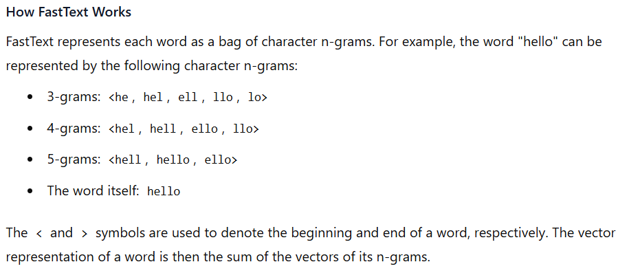

# Dense Vectors

Dense vectors are vectors where `most elements have non-zero values`. They are "densely populated" with meaningful values. Think of them as arrays where almost every position contains important information.

### Example of a dense vector:

    dense_vector = [0.5, 0.2, 0.8, 0.3, 0.9, 0.1]

**Real-world application**: Word embeddings like Word2Vec create dense vectors where each dimension represents some latent semantic feature of the word. For instance, a 5-dimensional word embedding might look like:

### Word "king" representation
king_vector = [0.9, -0.2, 0.3, 0.7, 0.4]

---

# Sparse Vectors

Sparse vectors have `most elements as zeros`, with only a `few non-zero values`. They are "sparsely populated" with meaningful values.

### Example of a sparse vector:

    sparse_vector = [0, 0, 0, 2, 0, 0, 0, 0, 3, 0, 0, 1, 0, 0, 0]

**Real-world application**: One-hot encoding of words in a vocabulary of 10,000 words. If we're representing the word "cat" which is the 234th word in our vocabulary:

### document classification example:

    Sparse representation (Bag of Words):
    Document: "The cat sat on the mat"
    Vocabulary: ["the", "cat", "sat", "on", "mat"]
    Sparse vector: [2, 1, 1, 1, 1] (counting word occurrences)
    Dense representation (Word embeddings):
    Same document: "The cat sat on the mat"
    Each word converted to 3D embeddings and averaged
    Dense vector: [0.3, 0.5, 0.2] (compressed semantic representation)
    Memory and Computation Considerations

### Dense vectors:

- Require storage for all elements
- Efficient for matrix operations
- Better for deep learning models

### Sparse vectors:

- Can be stored efficiently (only non-zero values)
- Memory efficient for large dimensionality
- Common in traditional machine learning (like TF-IDF)

---

# Embeddings

Embeddings are a fundamental concept in machine learning and natural language processing (NLP). They are numerical representations of data, such as words, sentences, or even entire documents, that capture their meaning, relationships, and context in a way that machines can process. Embeddings transform high-dimensional, sparse data (like text) into lower-dimensional, dense vectors, making it easier for models to understand and work with the data.

## Key Characteristics of Embeddings:

- **Dimensionality Reduction**: Embeddings reduce the complexity of data by representing it in a lower-dimensional space. For example, a word might be represented as a vector of 50, 100, or 300 dimensions instead of a one-hot encoded vector with thousands of dimensions.

- **Semantic Meaning**: Embeddings capture semantic relationships between words or entities. For instance, words with similar meanings (e.g., "king" and "queen") will have similar vector representations.

- **Context Awareness**: Modern embeddings, such as those from models like BERT or GPT, are context-aware, meaning they can represent the same word differently depending on its context in a sentence.

- **Generalization**: Embeddings allow models to generalize better by learning patterns and relationships from large datasets, which can then be applied to new, unseen data.

## Types of Embeddings

There are several types of embeddings used in Natural Language Processing (NLP):

1. **Word Embeddings**: These represent individual words as dense vectors in a continuous vector space.
   - Word2Vec: Uses neural networks to learn word representations, with two main variants: Skip-gram and Continuous Bag of Words (CBOW).
   - GloVe (Global Vectors): Leverages global word-word co-occurrence statistics to create embeddings.
   - FastText: It extends the concept of word embeddings to subword information, allowing it to generate vectors for out-of-vocabulary words by breaking them down into character n-grams.

2. **Sentence Embeddings**: Represent entire sentences as vectors, capturing their overall meaning.
   - Simple averaging of word vectors
   - More advanced models that consider word order and sentence structure

3. **Character Embeddings**: Represent individual characters as vectors, useful for handling out-of-vocabulary words and morphologically rich languages.

4. **Byte Pair Encoding (BPE)**: A hybrid approach between character and word-level embeddings, which breaks words into subword units.

5. **Contextualized Embeddings**: Generate dynamic representations based on the context in which words appear.
   - BERT (Bidirectional Encoder Representations from Transformers): Produces high-quality context-aware embeddings using attention mechanisms.

6. **Document Embeddings**: Represent entire documents as vectors, capturing their overall content and meaning.

---

# Word Embedding 

Word embedding is a technique in natural language processing (NLP) where words or phrases from a vocabulary are mapped to vectors of real numbers. This mapping allows words with similar meanings to have similar representations in a high-dimensional space, capturing semantic relationships between words.

# old methods or slow methods 

# Bag of Words (BoW) and TF-IDF
Bag of Words (BoW) and TF-IDF are fundamental techniques in natural language processing used for text representation and feature extraction. Let's explore each in detail:

- **Bag of Words (BoW)**:
Bag of Words is a simple yet effective method for representing text data. It involves the following steps:

- Tokenization: Breaking down the text into individual words or tokens.
Vocabulary Creation: Creating a vocabulary of all unique words across the entire corpus.
- Vectorization: Representing each document as a vector where each element corresponds to the frequency of a word from the vocabulary in that document.

#### Example:

    Consider two sentences:

    "The cat is sleeping on the couch."
    "The dog is resting on the sofa."

    The vocabulary would be: ["the", "cat", "is", "sleeping", "on", "couch", "dog", "resting", "sofa"].

    The BoW representation would be:

    Sentence 1: [2, 1, 1, 1, 1, 1, 0, 0, 0]
    Sentence 2: [2, 0, 1, 0, 1, 0, 1, 1, 1]

    BoW treats each word independently and does not consider the order of words, hence the term "bag of words." It's useful for tasks like text classification and information retrieval but has limitations, such as not capturing word order or semantic relationships.

# TF-IDF (Term Frequency-Inverse Document Frequency)
TF-IDF is an extension of the BoW model that takes into account the importance of words in the entire corpus. It consists of two components:

- **Term Frequency (TF)**: Measures how frequently a term appears in a document. It's calculated as:

    TF(t,d)=Total number of terms in document dNumber of times term t appears in document d​

- **Inverse Document Frequency (IDF)**: Measures the importance of a term across the entire corpus. It's calculated as:

    IDF(t)=log(Number of documents with term t / Total number of documents​)

    The TF-IDF score for a term in a document is then:

    TF-IDF(t,d)=TF(t,d) × IDF(t)

#### Example:

    Using the same sentences as above:

    "The cat is sleeping on the couch."
    "The dog is resting on the sofa."

    The TF-IDF scores would be calculated for each word based on its frequency in the document and its rarity across the corpus. For instance, "cat" and "couch" would have higher TF-IDF scores in the first sentence because they are unique to that sentence, while "the" and "is" would have lower scores due to their commonality.

    TF-IDF helps in distinguishing important words in a document by giving higher weights to terms that are frequent in a document but rare in the corpus. It's widely used in information retrieval, text mining, and document classification.

#### Comparison
- **BoW**: Simple and straightforward, but does not account for the importance of words across the corpus.
- **TF-IDF**: More sophisticated, as it considers both the frequency of words in a document and their rarity across the corpus, making it more effective for many applications.

In summary, while BoW provides a basic representation of text, TF-IDF enhances this representation by weighting words based on their significance, making it a more powerful tool for many NLP tasks.

- some popular methods are:
    1. **Word2Vec**: Developed by Google, Word2Vec can create word embeddings using two architectures: ***Continuous Bag of Words (CBOW) and Skip-gram***. CBOW predicts a target word based on its context, while Skip-gram predicts context words given a target word.
        - ***Continuous Bag of Words (CBOW)***: CBOW predicts a target word based on its context. It takes the surrounding words (context) as input and tries to predict the target word in the middle. The idea is that the context words can help infer the meaning of the target word.
        \
        [This is the reference](https://www.kdnuggets.com/2018/04/implementing-deep-learning-methods-feature-engineering-text-data-cbow.html).

        - ***Skip-gram***: Skip-gram does the opposite of CBOW. It takes a target word as input and tries to predict the surrounding context words. This method is based on the idea that a word can be understood by the company it keeps.
        \
        [This is the reference](https://medium.com/@RobuRishabh/learning-word-embeddings-with-cbow-and-skip-gram-b834bde18de4).
    
    2. **GloVe (Global Vectors for Word Representation)**

    3. **FastText**: FastText is a library for efficient learning of word representations and sentence classification developed by Facebook AI Research. It extends the concept of word embeddings to subword information, allowing it to generate vectors for ***out-of-vocabulary*** words by breaking them down into character n-grams.

        **FastText Working**
        

        **FastText Example**
        \
        [This is the reference](https://www.analyticsvidhya.com/blog/2023/01/introduction-to-fasttext-embeddings-and-its-implication/).

        - Benefits of FastText
            - **Handling Out-of-Vocabulary Words**: By using subword information, FastText can generate vectors for words it has never seen before.
            - **Capturing Morphological Information**: It can capture the meaning of words based on their parts, which is particularly useful for languages with rich morphology.
            -  **Efficiency**: FastText is designed to be fast and scalable, making it suitable for large datasets.

---

# Sentence Embedding
Sentence embedding is a technique in natural language processing (NLP) where entire sentences are mapped to vectors of real numbers. This mapping allows sentences with similar meanings or contexts to have similar representations in a high-dimensional space, capturing semantic relationships between sentences.

### **How Sentence Embedding Works**

## 1.  **Averaging Word Embeddings**:

(This is only one case) Similar to word embeddings, sentence embeddings aim to represent the meaning of a sentence in a way that can be processed by machine learning algorithms. The process typically involves:

- **Tokenization**: Breaking down the sentence into individual words or tokens.
- **Word Embedding**: Converting each token into a vector using techniques like Word2Vec, GloVe, or FastText.
- **Aggregation**: Combining these word vectors into a single vector that represents the entire sentence. This can be done through methods like averaging, using recurrent neural networks (RNNs), or more advanced models like transformers.

#### **Applications of Sentence Embedding**
- Sentence embeddings are used in various NLP tasks, including:
    - **Semantic Search**: Finding sentences or documents that are semantically similar to a given query.
    - **Text Classification**: Categorizing sentences into predefined classes based on their content.
    - **Sentiment Analysis**: Determining the sentiment or emotional tone of a sentence.
    - **Machine Translation**: Translating sentences from one language to another while preserving meaning.

#### Example
Consider the sentences:\
"The cat is sleeping on the couch."\
"The dog is resting on the sofa."\
Both sentences convey similar meanings about an animal resting on a piece of furniture. A good sentence embedding model would map these sentences to vectors that are close to each other in the vector space, reflecting their semantic similarity.

## 2.  **Transformer based Word Embeddings**:

Transformer models, like ***BERT (Bidirectional Encoder Representations from Transformers), RoBERTa***, and others, use ***self-attention mechanisms*** to weigh the importance of different words in a sentence relative to each other. This allows them to understand the context of words within a sentence more effectively than traditional methods.

#### The process of generating transformer-based sentence embeddings typically involves:

- **Tokenization**: Breaking down the sentence into tokens that the model can process.
- **Encoding**: Feeding these tokens into a pre-trained transformer model, which outputs contextualized embeddings for each token.
- **Pooling**: Aggregating these token embeddings into a single vector that represents the entire sentence. Common pooling methods include:
    - **CLS Token**: Using the embedding of the special [CLS] token, which is designed to capture the overall meaning of the sentence.
    - **Mean Pooling**: Averaging the embeddings of all tokens in the sentence.
    - **Max Pooling**: Taking the maximum value across each dimension of the token embeddings.

#### Advantages of Transformer-Based Sentence Embeddings
- **Contextual Understanding**: Transformers capture the context of words within a sentence, leading to more accurate representations.
- **Semantic Similarity**: They can better identify sentences with similar meanings, even if the wording is different.
- **Transfer Learning**: Pre-trained transformer models can be fine-tuned for specific tasks, making them highly adaptable.

#### Example

Consider the sentences:\
"The cat is sleeping on the couch."\
"The dog is resting on the sofa."\
A transformer-based model like BERT would process these sentences and generate embeddings that reflect their semantic similarity. The model would understand that "sleeping" and "resting" are similar in context, as are "couch" and "sofa."

#### Popular Models

- **BERT**: Uses bidirectional context to generate embeddings.
- **RoBERTa**: An optimized version of BERT with improved training procedures.
- **Sentence-BERT (SBERT)**: A modification of BERT specifically designed for generating high-quality sentence embeddings more efficiently

---

# BERT(Bidirectional Encoder Representations from Transformers)
[BERT ref 1](https://medium.com/@davidlfliang/intro-getting-started-with-text-embeddings-using-bert-9f8c3b98dee6https://medium.com/@davidlfliang/intro-getting-started-with-text-embeddings-using-bert-9f8c3b98dee6)\
[BERT Ref 2](https://medium.com/@shaikhrayyan123/a-comprehensive-guide-to-understanding-bert-from-beginners-to-advanced-2379699e2b51)\
[BERT Video](https://www.youtube.com/watch?v=xI0HHN5XKDo)\
BERT uses a transformer architecture to understand the context of words within a sentence bidirectionally, meaning it considers both the left and right context of each word. This bidirectional approach allows BERT to capture more nuanced and contextually rich representations of sentences.

The process of generating BERT sentence embeddings involves the following steps:

- **Tokenization**: The input sentence is broken down into tokens. BERT uses `WordPiece tokenization`, which splits words into `subwords` to handle `out-of-vocabulary` words effectively.
- **Encoding**: These tokens are then fed into the BERT model. BERT `adds special tokens` to the input:
    - **[CLS]**: A classification token added at the beginning of the sentence, which is used to represent the entire sentence.
    - **[SEP]**: A separator token added at the end of the sentence.
- **Embedding Generation**: BERT processes the tokens and generates contextualized embeddings for each token. The embedding of the [CLS] token is often used as the sentence embedding because it is designed to capture the overall meaning of the sentence.
- **Pooling (Optional)**: While the [CLS] token embedding is commonly used, other pooling methods can be applied to generate the final sentence embedding:
    - **Mean Pooling**: Averaging the embeddings of all tokens in the sentence.
    - **Max Pooling**: Taking the maximum value across each dimension of the token embeddings.

#### Example

Consider the sentence: "The cat is sleeping on the couch."\
Tokenization: [CLS] The cat is sleeping on the couch [SEP]\
Encoding: BERT processes these tokens and generates embeddings for each.\
Sentence Embedding: The embedding of the [CLS] token is used as the sentence embedding.

---

# Limitations of BERT over S-BERT
[Sbert Reference](https://towardsdatascience.com/sbert-deb3d4aef8a4/)\
While BERT (Bidirectional Encoder Representations from Transformers) is a powerful model for generating sentence embeddings, it has several limitations when compared to Sentence-BERT (SBERT), a modification specifically designed for efficient and effective sentence embedding generation. Here are the key limitations of BERT over SBERT:

1. Computational Efficiency

    - BERT: Generating sentence embeddings with BERT involves processing each sentence individually, which can be computationally expensive, especially for large datasets. The time complexity for comparing sentences using BERT embeddings is O(n^2), where n is the number of sentences.

    - SBERT: SBERT is designed to be more efficient. It uses siamese and triplet network structures to generate sentence embeddings that can be compared using cosine similarity, reducing the time complexity to O(n). This makes SBERT much faster for tasks like semantic search and clustering.

2. Semantic Similarity

    - BERT: While BERT can generate high-quality embeddings, it is not optimized for semantic similarity tasks out of the box. The embeddings generated by BERT are not directly comparable using simple metrics like cosine similarity without additional fine-tuning.

    - SBERT: SBERT is specifically fine-tuned for semantic similarity tasks. It is trained on datasets like SNLI (Stanford Natural Language Inference) and MultiNLI, which makes its embeddings more suitable for tasks requiring semantic comparison.

3. Fine-Tuning Requirements

    - BERT: To use BERT for tasks like semantic search or clustering, it often requires additional fine-tuning on specific datasets, which can be time-consuming and resource-intensive.

    - SBERT: SBERT comes pre-trained for semantic similarity tasks, reducing the need for extensive fine-tuning. This makes it more user-friendly and ready-to-use for many applications.

4. Memory Usage

    - BERT: BERT models are typically larger and require more memory to run, especially when processing multiple sentences.

    - SBERT: SBERT models are often smaller and more memory-efficient, making them more suitable for deployment on resource-constrained environments.

5. Scalability

    - BERT: Due to its computational and memory requirements, BERT can be less scalable for large-scale applications where efficiency is crucial.

    - SBERT: SBERT's design allows it to scale better for large datasets and real-time applications, making it a more practical choice for many use cases.

#### Example

Consider a scenario where you need to find the most similar sentence to "The cat is sleeping on the couch" from a large corpus of sentences:

BERT: You would need to generate embeddings for each sentence in the corpus using BERT, then compare the embeddings using a similarity metric like cosine similarity. This process would be slow and resource-intensive.

SBERT: With SBERT, you can generate embeddings for all sentences in the corpus more efficiently and then use cosine similarity to find the most similar sentence quickly.

In summary, while BERT is a versatile and powerful model, its limitations in terms of computational efficiency, semantic similarity, fine-tuning requirements, memory usage, and scalability make SBERT a more practical choice for many sentence embedding tasks.

> [!NOTE]\
> Useful References.\
>[What Are Word and Sentence Embeddings](https://cohere.com/llmu/sentence-word-embeddings).\
>[BERT](https://medium.com/@davidlfliang/intro-getting-started-with-text-embeddings-using-bert-9f8c3b98dee6https://medium.com/@davidlfliang/intro-getting-started-with-text-embeddings-using-bert-9f8c3b98dee6).