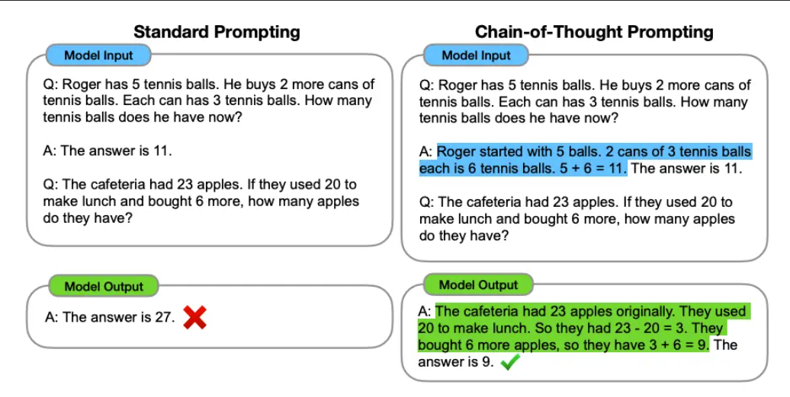
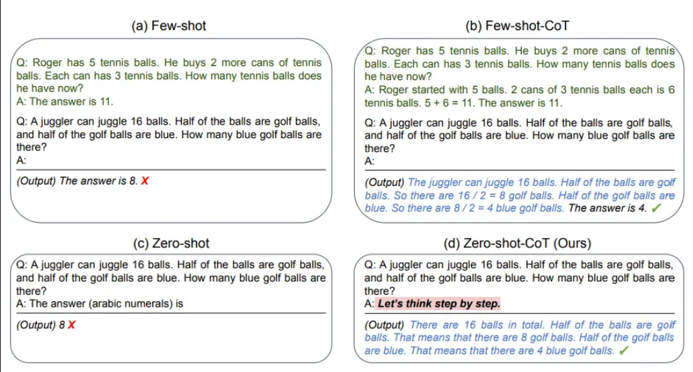
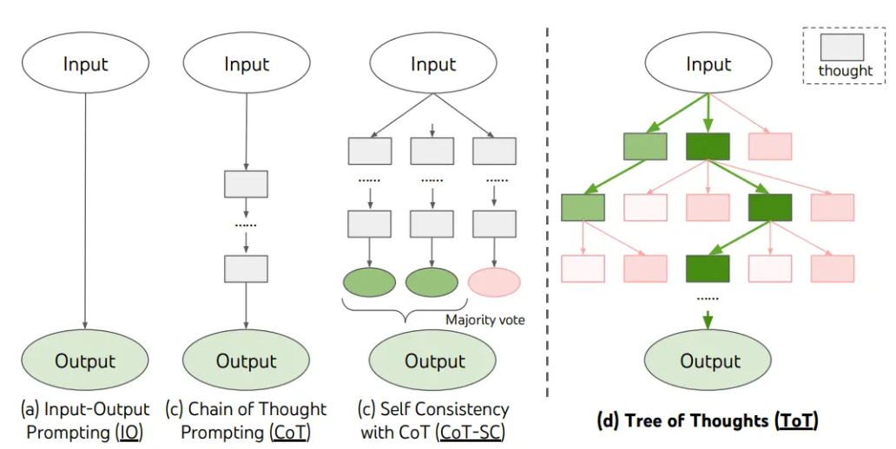
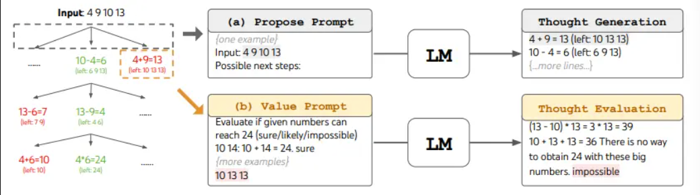

# Prompt Engineering

## Table of Contents
  - [What is Prompt Engineering?](#what-is-prompt-engineering)
  - [What is Prompts?](#what-is-prompt)
  - [Anatomy of a Good Prompt](#the-anatomy-of-a-good-prompt)
- [Basic Techniques](#basic-prompt-techniques)
  - [Zero-Shot Prompting](#zero-shot-prompting)
  - [One-Shot Prompting](#one-shot-prompting)
  - [Few-Shot Prompting](#few-shot-prompting)
- [Advanced Techniques](#advanced-prompt-techniques)
  - [Chain-of-Thought (CoT)](#chain-of-thought-prompting)
  - [Tree-of-Thought (ToT)](#tree-of-thought-prompting)


1. **what is Prompt Engineering?**

    Prompt engineering is the practice of crafting carefully designed inputs (or “prompts”) that guide AI language models (such as ChatGPT, GPT‑4, and others) to generate the type of responses you want. Think of it as designing clear instructions for an assistant who has read billions of documents but still needs you to tell them exactly what you need.

    Prompt engineering is important because even though AI models have extensive training, their responses depend heavily on the quality, clarity, and structure of the prompts. A well-crafted prompt can mean the difference between a vague, off‐target answer and a precise, insightful response.

2. **what is Prompt?**

    A prompt is the input you provide to an AI model to elicit a response. It can be a question, instruction, or context that guides the model to perform a task.

    - **Types of Prompts**

        - **Direct Prompts**: Clear and specific instructions (e.g., "Write a poem about the ocean.").
        - **Indirect Prompts:** Open-ended or vague instructions (e.g., "Tell me something interesting.").
        - **Open-Ended Prompts:** Encourage creativity and exploration (e.g., "What are some futuristic technologies?").
        - **Specific Prompts:** Focus on a particular task or detail (e.g., "Summarize this article in 100 words.").

3. **The Anatomy of a Good Prompt**

    A strong prompt is typically composed of four essential elements:

    - **Instructions**: This is the command or question that tells the AI what to do. A ***clear instruction*** might be as direct as “summarize the following article in 100 words” or “explain the concept of gravity as you would to a middle school student.”
    - **Context**: Context provides ***background information*** that helps the AI understand the topic or situation. For example, if you’re asking the AI to write a business email, you could include details such as the audience, tone, or specific points that need emphasis.
    - **Input Data**: Input data can be any ***relevant information or examples*** you supply. For instance, if you ask for a summary, you might provide the text you want summarized. The better the input, the more tailored the output.
    - **Output Indicators**: Finally, specify how you want the answer formatted. This might include the desired structure (bullet points, paragraphs, lists), the length (word or sentence limits), or even the tone (formal, casual, technical).

# Prompt Techniques

These techniques can be combined and adapted to create more effective and tailored prompts for specific tasks and domains.

1. **Zero-Shot Prompting**:
    
   Zero-shot prompting is a technique used in artificial intelligence where a model is tasked with generating a response or performing an action without being provided any specific examples or prior training for that particular task. This approach relies on the model's ability to generalize from its extensive pre-training on diverse datasets, allowing it to apply its learned knowledge to new, unseen tasks.

    ### Key Characteristics of Zero-Shot Prompting

    - **No Prior Examples**: The model receives no examples to guide its response.
    - **Generalization**: It utilizes its pre-existing knowledge to infer the appropriate output based on the prompt.
    - **Flexibility**: This method enables the model to adapt to various tasks without needing task-specific fine-tuning.

    Here's an example of one-shot prompting
    ```
    Here’s a practical example to illustrate zero-shot prompting:

    Prompt: "Translate the following sentence into French: 'I love learning new languages.'"
    Response: "J'adore apprendre de nouvelles langues."
    ```
    In this example, the prompt clearly instructs the model to perform a translation without providing any examples of translations. The model uses its understanding of both English and French, along with its knowledge of translation conventions, to generate the correct response.

    Zero-shot prompting showcases the impressive capability of large language models to generalize from their training, making it a powerful tool for various applications where examples may not be readily available.

2. **One-Shot Prompting**:
    One-shot prompting is a technique in artificial intelligence where a language model is provided with a single example to guide its understanding and execution of a specific task. This method sits between zero-shot learning (no examples) and few-shot learning (multiple examples), offering a minimal yet potentially effective way to direct the model's behavior.

    The key aspects of one-shot prompting include:

    1. Providing a single example within the prompt
    2. Giving the model a clear indication of the expected input-output relationship
    3. Leveraging the model's ability to learn from a single instance and apply that learning to similar scenarios

    Here's an example of one-shot prompting:

    ```
    Classify the sentiment of the following sentence as positive, negative, or neutral:

    Example:
    Input: "The movie was absolutely fantastic!"
    Output: Positive

    Now classify this sentence:
    Input: "The new restaurant's food was delicious, but the service was terribly slow."
    Output:
    ```

    In this example, the model is given a single instance of sentiment classification before being asked to classify a new sentence. This helps the AI understand the task and expected output format.

    One-shot prompting is particularly useful when:

    1. Training data is limited
    2. Quick adaptation to new tasks is needed
    3. The task requires some guidance but not extensive examples

    It's important to note that while one-shot prompting can be effective, its reliability may vary depending on the complexity of the task and the model's capabilities. In some cases, more examples (few-shot prompting) or no examples (zero-shot prompting) might be more appropriate, depending on the specific requirements of the task and the model's pre-existing knowledge.

3. **Few-Shot Prompting**:
    It is a technique in artificial intelligence where a language model is provided with a small number of examples (typically 2–10) within the prompt to help it understand and perform a specific task. It acts as a middle ground between zero-shot prompting (no examples) and one-shot prompting (a single example). Few-shot prompting allows the model to infer the task, recognize patterns, and generalize to new inputs based on the examples provided.

    How Few-Shot Prompting Works
    1. **Task Instruction**: The prompt begins with a clear explanation of the task.
    2. **Examples**: A small set of input-output pairs is included to demonstrate the desired behavior or format.
    3. **New Input**: The model is then presented with a new input for which it must generate an output based on the patterns it learned from the examples.

    ### Example of Few-Shot Prompting

    #### Task: Sentiment Analysis
    The goal is to classify sentences as "Positive," "Negative," or "Neutral."

    **Prompt**:
    ```
    Classify the sentiment of each sentence as Positive, Negative, or Neutral:

    Example 1:
    Sentence: "I absolutely loved the movie; it was fantastic!"
    Sentiment: Positive

    Example 2:
    Sentence: "The food was disappointing and lacked flavor."
    Sentiment: Negative

    Example 3:
    Sentence: "The weather today is fine, nothing special."
    Sentiment: Neutral

    Now classify this sentence:
    Sentence: "The service at the restaurant was excellent, but the wait time was too long."
    Sentiment:
    ```

    **Explanation**:
    - The model sees three examples demonstrating how to classify sentiments.
    - Based on these examples, it identifies patterns like positive words ("loved," "fantastic") and negative words ("disappointing," "lacked").
    - It applies these patterns to classify the new sentence as *Neutral* (since both positive and negative aspects are present).


    ### Advantages of Few-Shot Prompting
    - **Flexibility**: Can adapt to various tasks without retraining.
    - **Efficiency**: Requires fewer examples compared to traditional fine-tuning.
    - **Customizability**: Allows users to tailor prompts for specific needs by carefully selecting examples.

    ---

    ### Limitations
    - **Context Length Constraints**: Limited by the model's token capacity, which restricts how many examples can be included.
    - **Example Dependency**: Poorly chosen examples can lead to incorrect outputs.
    - **Performance Variability**: May not perform well for highly complex or specialized tasks without additional guidance.

    Few-shot prompting strikes a balance between minimal data requirements and robust task performance, making it a powerful tool for tasks where labeled data is scarce or unavailable.

4. **Chain-of-Thought Prompting**:

    Chain of Thought is a prompting technique where we encourage AI models to break down complex problems into smaller steps and explicitly show their reasoning process. Rather than jumping straight to an answer, the model explains its thinking path step by step.
    
    ### How it Works

    1. Instead of asking for direct answers, we prompt the model to "think step by step"
    2. The model breaks down the problem into logical segments
    3. Each step builds on previous steps to reach the final conclusion
    4. The reasoning process is made explicit and visible

    ### Benefits

    1. Improved accuracy for complex problems by reducing errors in reasoning
    2. Better transparency into how the model reaches conclusions
    3. Easier verification and debugging of the model's thought process
    4. More reliable results for mathematical and logical problems
    5. Helps identify potential mistakes before reaching final answers

    ### Example
    #### Chain-of-thoughts
    


    #### Zero-dhot COT
    

5. **Tree-of-Thought Prompting**

    Tree of Thoughts is an advanced problem-solving framework that extends chain-of-thought prompting by exploring multiple reasoning paths simultaneously, similar to how humans brainstorm different approaches to solve complex problems.

    ### How It Works

    1. State Generation: Generate multiple intermediate thoughts/states at each step
    2. State Evaluation: Evaluate the promise of each state
    3. State Selection: Choose which states to expand further
    4. Tree Search: Use strategies like breadth-first or depth-first search to explore the reasoning paths

    ### Benefits

    1. More thorough exploration of solution spaces
    2. Better handling of complex, multi-step problems
    3. Reduced chances of getting stuck in suboptimal reasoning paths
    4. Improved self-correction through evaluation of different approaches
    5. More systematic problem-solving compared to linear thinking

    #### Frame work 
    

    ### Example
    
